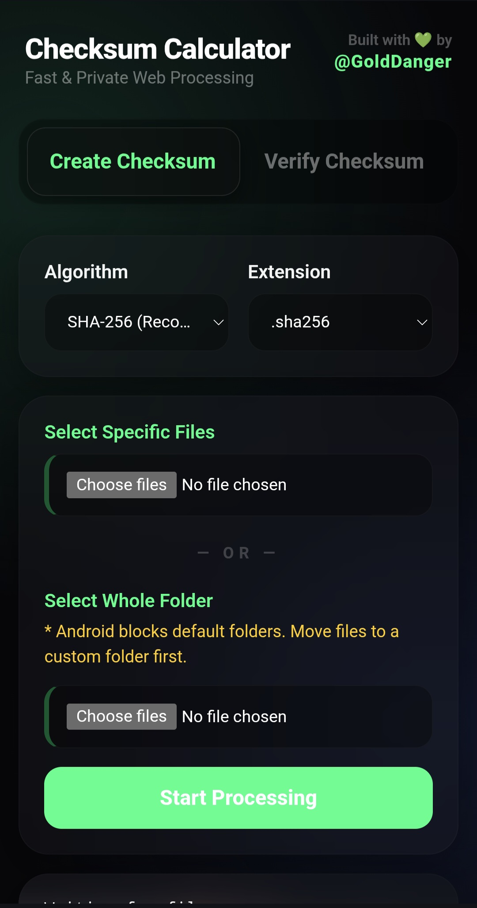
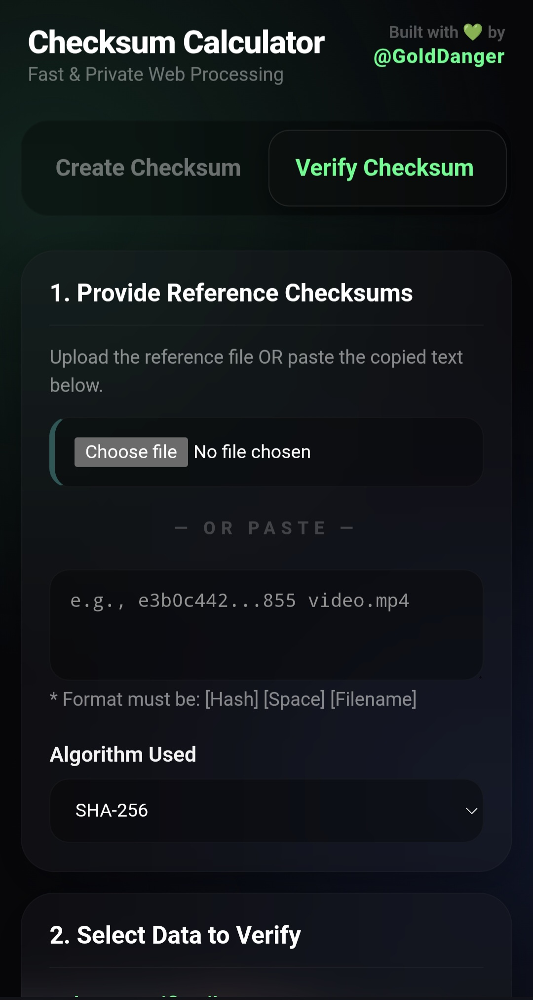

# Checksum Calculator 🛡️
A fast, 100% private, client-side utility to generate and verify file checksums. Built to handle files securely without ever uploading your data to a server.

Try It Instantly - https://golddanger.github.io/checksum-calculator/

Built with 💚 by **@GoldDanger**

| Create Engine | Verify Engine |
| :---: | :---: |
|  |  |

## 💡 Why This Exists
I needed a reliable bulk checksum tool for mobile, but I couldn't find one that was simple and effective. Using complex Termux commands every time I wanted to check a file was too much friction. I built this tool to make the process easy for myself and to help others who want a clean, powerful, and private way to handle file integrity on the go.

## 📱 Two Editions Available

### 1. The Web App (Recommended)
A lightweight Progressive Web App (PWA) that runs instantly in your browser. 
* **Live Link:** https://golddanger.github.io/checksum-calculator/
* **Features:** Installable to your home screen, automatic HTTPS clipboard support, and blazing fast processing.

### 2. The Offline Air-Gapped Edition
A standalone HTML file with the Self-contained crypto engine (fully offline, no dependencies) embedded directly inside.
* **File:** `Checksum_Calculator_Offline.html`
* **Features:** Bypasses CORS restrictions, works with zero internet, and is perfect for secure storage. Download it and open it in any browser while in Airplane mode.

## 🛠️ Use Cases
* **Verify Downloads:** Ensure your ROMs, ISOs, or media files aren't corrupted.
* **Check File Integrity:** Confirm files match exactly after moving them between folders or devices.
* **Backup Validation:** Quickly verify that a copied file is a perfect match of the original.

## ⚙️ Supported Algorithms
* **SHA-256** (Recommended)
* **SHA-512**
* **SHA-1**
* **MD5** (For legacy verification)